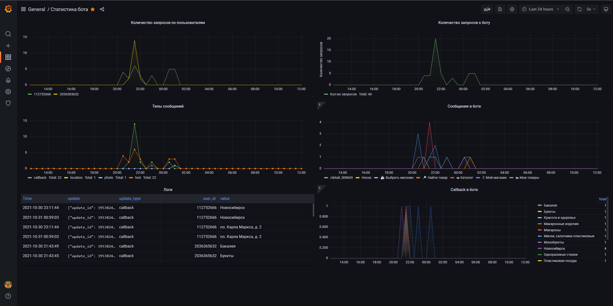
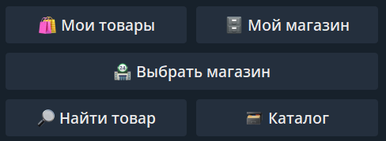
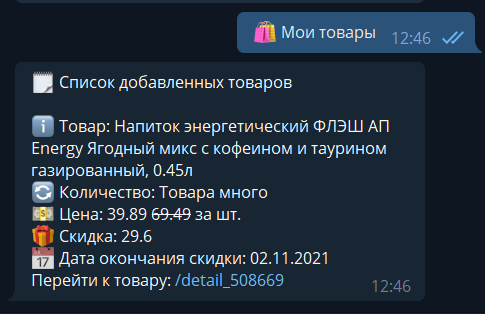
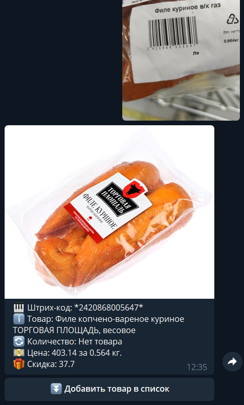
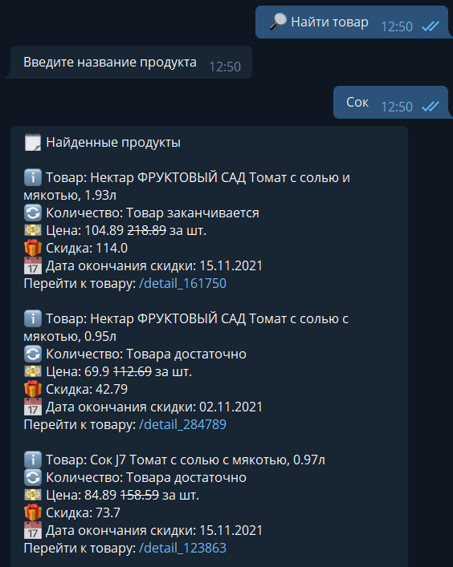
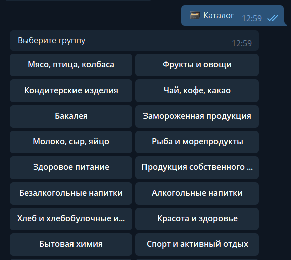
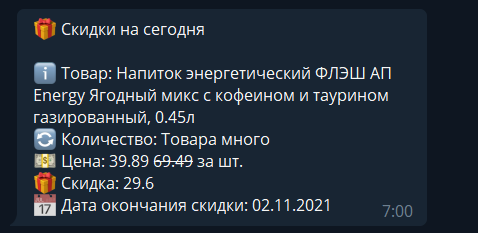

## Описание проекта

Telegram бот для просмотра информации о товарах в магазине Лента  
Бот [@lentacom_bot](https://t.me/lentacom_bot)

### Текущие возможности
* Выбор магазина через клавиатура или отправку геопозиции
* Получение информации о товаре по фото со штрих-кодом
* Получение информации о весе товара по штрих-коду
* Добавление товара в личный список
* Просмотр товаров в личном списке
* Ежедневное оповещение пользователей о скидках на добавленные товары
* Поиск товара через каталог
* Кэширование запросов к API Lenta.com
* Просмотр статистики через Grafana

### TODO
* Список покупок
* Настройки уведомлений

### Используемые технологии
* Python 3.9 - Язык программирования
* Docker и docker-compose - Контейнеризация и деплой приложения
* aiogram - Асинхронный фреймворк для разработки Telegram ботов
* influxDB - СУБД для хранения временных рядов
* PostgreSQL - СУБД реалиационной БД
* Grafana - Визуализация данных

## Демонострация ключевых возможностей

### Статистика бота в Grafana

### Главное меню

### Личный список товаров

### Поиск товара по фото штрихкоду

### Поиск товара по названию

### Поиск товара по каталогу

### Ежедневное уведомление о скидках на товары из личного списка
